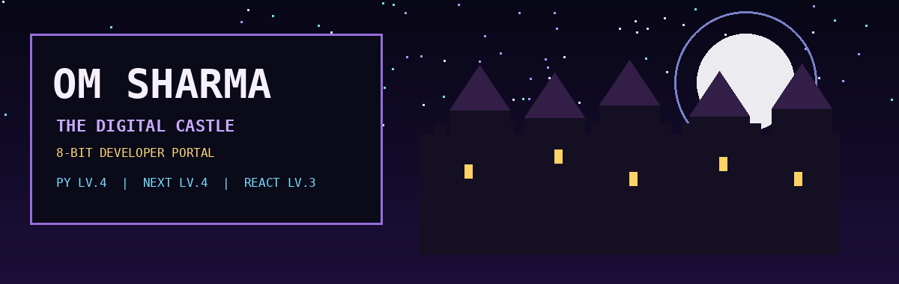

<div align="center">

<a href="https://omsharmacruz.github.io">

</a>

<br>

# ☾ OM SHARMA ☽

### SOFTWARE DEVELOPER · DIGITAL CASTLE KEEPER

Python · Ruby · Angular · React · Next.js

<br>

<a href="https://omsharmacruz.github.io">

</a>

</div>

---

## 🛡️ STATUS SCREEN

```text
NAME     : OM SHARMA
CLASS    : SOFTWARE DEVELOPER
LEVEL    : 21

HP  ████████████████
MP  ███████████░░░░░

PYTHON      LV.4
RUBY        LV.2
ANGULAR     LV.2
REACT       LV.3
NEXT.JS     LV.4
```

---

## 📜 QUEST LOG

```text
[ACTIVE]
> Build full-stack applications
> Learn Ruby on Rails + Angular
> Create memorable digital experiences

[CLEARED]
> MyMovieList
> HAM10000 CNN Classification

[CURRENT QUEST]
> Digital Castle Portfolio
```

---

## 🗺️ CASTLE MAP

```text
                 ☾ MOON TOWER ☾

                      |
                      |
              +---------------+
              |  ENTRANCE     |
              +---------------+
                 /     |     \

          SKILLS   PROJECTS   PROFILE

                 \     |     /

              +---------------+
              |   CONTACT     |
              +---------------+
```

---

## ⚔️ DEVELOPER LOADOUT

| Skill | Level |
|---|---|
| Python | LV.4 |
| Ruby | LV.2 |
| Angular | LV.2 |
| React | LV.3 |
| Next.js | LV.4 |

## 🎨 CREATIVE LOADOUT

| Tool | Level |
|---|---|
| After Effects | LV.4 |
| Premiere Pro | LV.3 |
| Photoshop | LV.2 |

---

## 🏰 FEATURED CHAMBERS

| Project | Description |
|-|-|
| MyMovieList | Movie discovery and watchlist platform |
| HAM10000 CNN | Skin lesion classification project |
| Digital Castle | Interactive 8-bit portfolio |

---

### ENTER THE CASTLE

https://omsharmacruz.github.io

