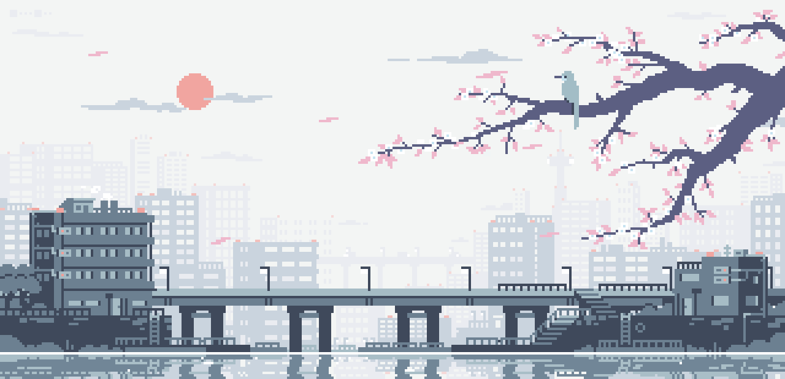
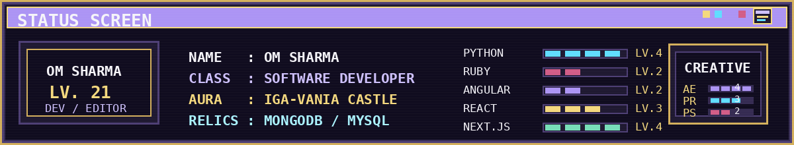
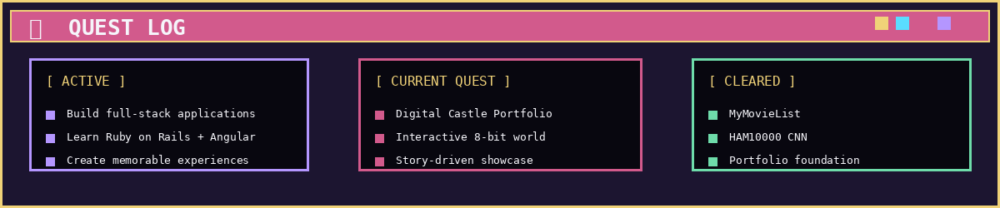
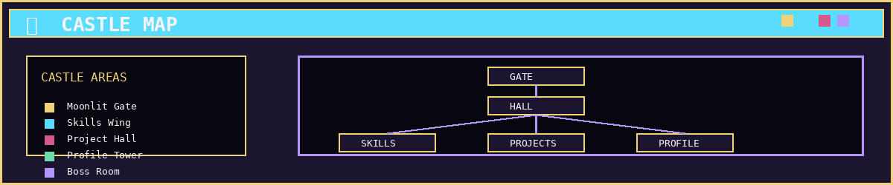
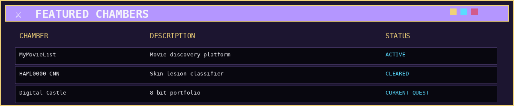
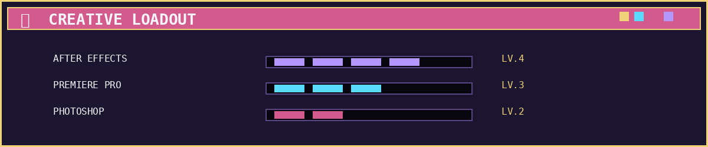
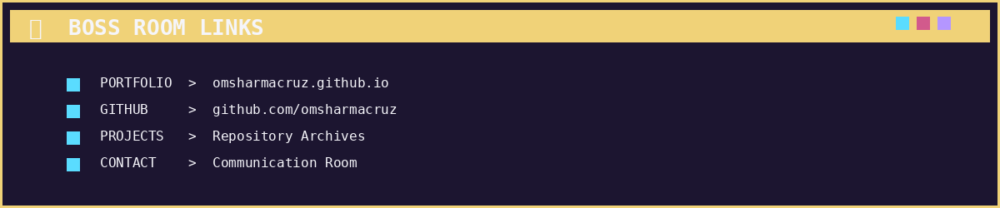

 

# ☾ OM SHARMA ☽
### SOFTWARE DEVELOPER · DIGITAL CASTLE KEEPER

`Python` · `Ruby` · `Angular` · `React` · `Next.js`

 

 

**[ENTER THE FULL PORTFOLIO →](https://omsharmacruz.github.io)**

---

---

---

---

---

---

---

## ⚔ DEVELOPER LOADOUT

| Skill | Level |
|---|---|
| Python | LV.4 |
| Ruby | LV.2 |
| Angular | LV.2 |
| React | LV.3 |
| Next.js | LV.4 |

## 🎨 CREATIVE RELICS

| Tool | Level |
|---|---|
| After Effects | LV.4 |
| Premiere Pro | LV.3 |
| Photoshop | LV.2 |

