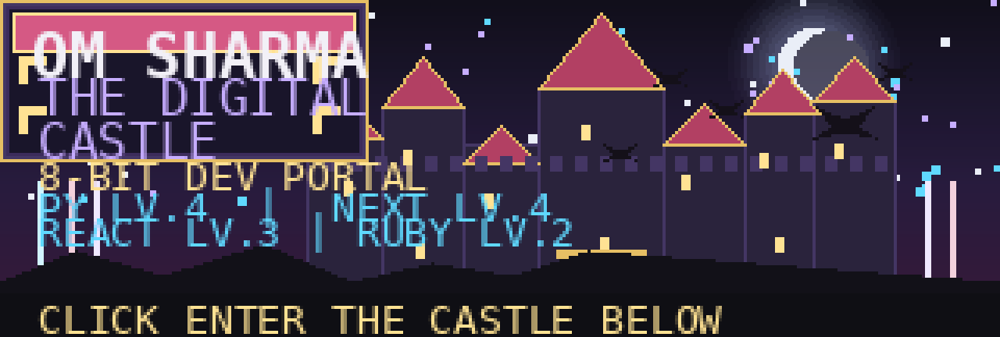
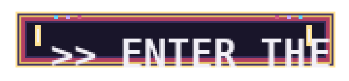
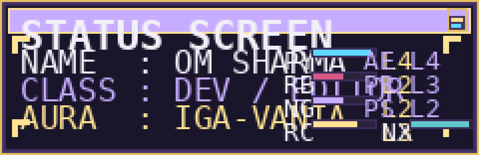
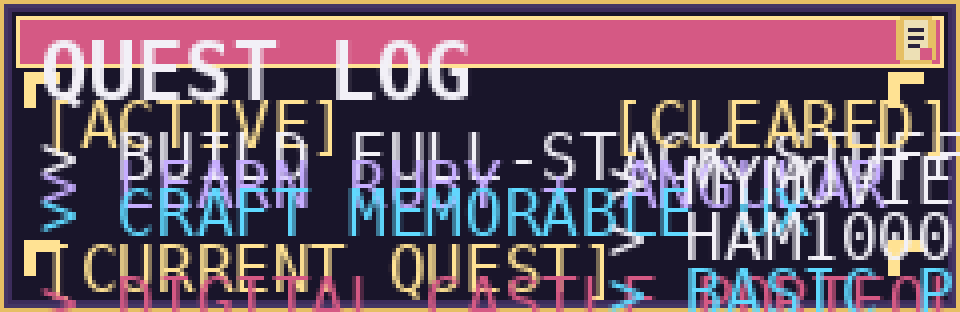
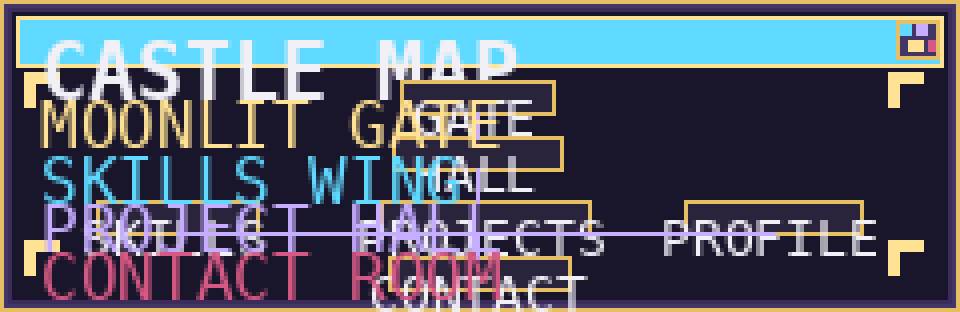

 

# ☾ OM SHARMA ☽
### SOFTWARE DEVELOPER · DIGITAL CASTLE KEEPER

`Python` · `Ruby` · `Angular` · `React` · `Next.js`

 

**[ENTER THE FULL PORTFOLIO →](https://omsharmacruz.github.io)**

---

  

---

  

---

  

---

## ⚔ FEATURED CHAMBERS

| Chamber | Description | Status |
|---|---|---|
| **MyMovieList** | Movie discovery and watchlist platform | `ACTIVE` |
| **HAM10000 CNN** | Skin-lesion classification project | `CLEARED` |
| **Digital Castle** | Interactive 8-bit portfolio | `CURRENT QUEST` |

---

## 🎨 CREATIVE LOADOUT

| Tool | Level |
|---|---|
| After Effects | LV.4 |
| Premiere Pro | LV.3 |
| Photoshop | LV.2 |

---

## 🔗 BOSS ROOM LINKS

- **Portfolio:** https://omsharmacruz.github.io
- **GitHub:** https://github.com/omsharmacruz
- **Projects:** add your own project links here
- **Contact:** add your own links here
